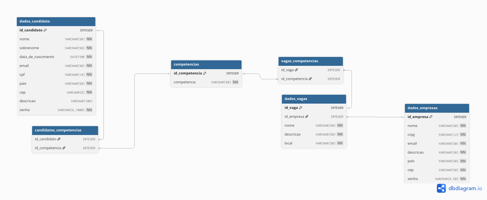

# Projeto Linketinder

É possivel rodar o programa direto do terminal na pasta inicial usando o comando:
```
./gradlew run
```

obs: Deve estar dentro da pasta linketinder

Atualização: Implementação do sistema de curtidas
Na nova atualização os status das curtidas são mantidos em um novo arquivo json com os status "aguardand" ou "em match"


A tecnologia Usada para o frontend foi o Typescript e os testes foram implementados em groovy
Modelagem do banco de dados: 


Nome: Gabriel Perrout
